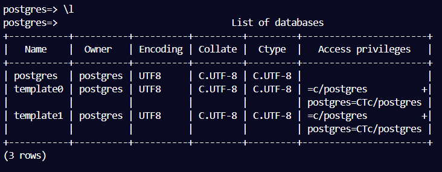

# Student Database Project Part 1 using PostgreSQL and Bash

This project involves creating and populating a student database using PostgreSQL. The database is created based on data from two CSV files: students.csv and courses.csv. The project structure includes a bash script to automate the data insertion process.

## Project Structure

```

/project_directory
│
├── /screenshots
│   └── (contains project screenshots)
│
├── courses.csv
│   └── (CSV file containing course data)
│
├── students.csv
│   └── (CSV file containing student data)
│
├── insert_data.sh
│   └── (Bash script to insert data from CSV files into the PostgreSQL database)
│
└── students.sql
    └── (SQL script to create the database tables)

```

## Database Schema

### Tables

1. students

   - student_id SERIAL PRIMARY KEY NOT NULL
   - first_name VARCHAR(50) NOT NULL
   - last_name VARCHAR(50) NOT NULL
   - major_id INTEGER REFERENCES majors(major_id)
   - gpa NUMERIC(2,1)

2. courses

   - course_id SERIAL PRIMARY KEY NOT NULL
   - course VARCHAR(100) NOT NULL

3. majors

   - major_id SERIAL PRIMARY KEY NOT NULL
   - major VARCHAR(100) NOT NULL

4. majors_courses

   - major_id INT NOT NULL REFERENCES majors(major_id)
   - course_id INT NOT NULL REFERENCES courses(course_id)

## Files

- **students.sql:** Contains the SQL commands to create the database tables.
- **courses.csv:** CSV file with columns major and course.
- **students.csv:** CSV file with columns first_name, last_name, major, and gpa.
- **insert_data.sh:** Bash script to insert data from courses.csv and students.csv into the PostgreSQL database.

## Screenshots

Screenshots of the project and its execution can be found in the /screenshots directory.




